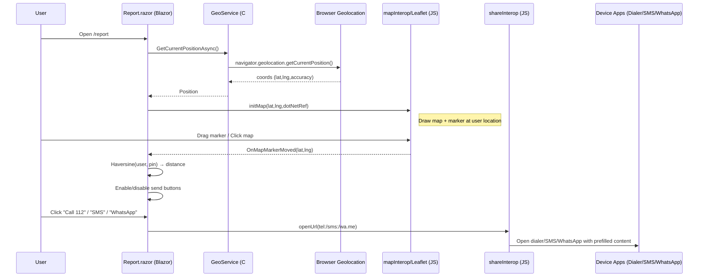

# PinTheHighwayCrash — Architecture & Data Flow

This document describes the architecture, component connections, and data flow for the **free, client-only Blazor WebAssembly** app. It also outlines an **optional future** mobile + backend setup.

---

## 1) High-level architecture (Free, client-only)

**Front-end (Blazor WebAssembly)**
- **`Pages/Report.razor`** — UI & orchestration (map, GPS, pin, distance gate, share actions)
- **`Services/GeoService.cs`** — wraps Browser Geolocation API via JS interop; Haversine distance
- **`wwwroot/js/mapInterop.js`** — Leaflet map (OpenStreetMap tiles), draggable marker, JS→.NET callbacks
- **`wwwroot/js/shareInterop.js`** — helper to open `tel:`, `sms:`, `wa.me` links and copy text

**External, free services**
- **OpenStreetMap tiles** (anonymous GET, attribution required)
- **Device apps** (Phone dialer, SMS app, WhatsApp)
- **Google Maps URL** (free link; no API key)

```text
User → Browser → Blazor WASM ↔ JS interop ↔ Leaflet/Geolocation APIs
                                  ↘ opens device intents (tel/sms/whatsapp)
```

---

## 2) Component connections

```text
+-------------------------------+           +------------------------+
|          Report.razor         |  JS interop  map init, setView    |
|  - UI state & validation      +----------->  mapInterop.js (Leaflet)---+
|  - calls GeoService           |           |  - shows OSM tiles          |
|  - builds message text        |  JS interop  marker moved events   |   |
|  - triggers ShareInterop      <-----------+  -> calls .NET method  |   |
+---------------+---------------+                                       |
                | C# call                                              |
                v                                                      |
       +--------+---------+                                           |
       |     GeoService   |                                           |
       | - getCurrentPos  |<-- JS interop -->  Browser Geolocation API |
       | - Haversine      |                                           |
       +--------+---------+                                           |
                |                                                     |
                v                                                     |
       +--------+---------+                                           |
       |   ShareInterop   |--- opens ---> tel:/sms:/https: (wa.me) ----+
       |  - openUrl       |
       |  - copyText      |
       +------------------+

External:
 - OpenStreetMap tiles (read-only, via Leaflet)
 - User’s Phone/SMS/WhatsApp apps handle the final message/call
 - Google Maps URL opened by recipients
```

---

## 3) Sequence diagram (main scenario)



---

## 4) Data model (client-only)

**GPS fix (`GeoService.Position`)**
```json
{
  "Latitude": 12.345678,
  "Longitude": 77.123456,
  "AccuracyMeters": 8.5
}
```

**Pinned point**
```json
{
  "pinLat": 12.345700,
  "pinLng": 77.123400
}
```

**Derived**
```json
{
  "distanceMeters": 42.0
}
```

**Report text (plain string)**
```
EMERGENCY: Highway accident reported.
Pinned Location: <lat>, <lng>
Reporter GPS: <lat>, <lng> (±<accuracy> m)
Note: <optional user text>
Map: https://maps.google.com/?q=<lat>,<lng>
Time (UTC): <timestamp>
```

---

## 5) Core flows

### App load & map init
1) `Report.razor` renders → requests GPS via `GeoService.GetCurrentPositionAsync()`  
2) `GeoService` calls `navigator.geolocation.getCurrentPosition` (JS) → browser prompt → coords  
3) `Report.razor` sets **user** & **pin** to the same coords  
4) `mapInterop.initMap` draws Leaflet map + marker  
5) UI shows distance (0 m) and enables actions

### User moves the pin
1) User drags/clicks → Leaflet fires event  
2) JS calls `.NET` method `OnMapMarkerMoved(lat,lng)`  
3) `Report.razor` recomputes distance via `GeoService.HaversineMeters`  
4) UI updates; send actions enabled only if ≤ `150 m`

### Send actions (free)
- **Call 112** via `tel:112` link  
- **SMS** via `sms:?&body=<encoded>` (prefilled)  
- **WhatsApp** via `https://wa.me/?text=<encoded>`  
- **Copy** via `navigator.clipboard.writeText`

All actions are blocked unless **on-site** (≤ 150 m).

---

## 6) Responsibilities

- **Report.razor**: UI state, validation, message creation, triggers share actions  
- **GeoService**: geolocation & distance math  
- **mapInterop.js**: map/tiles/marker, JS→.NET callbacks  
- **shareInterop.js**: opening device intents & clipboard

---

## 7) Optional future: Mobile (.NET MAUI + Blazor Hybrid) + Backend

**Mobile app**
- Reuse Report UI in Blazor WebView
- Replace web geolocation with native `ILocationService`
- Use `IDialerService` and `ISmsService` for dial/SMS composers
- Optionally use **MapLibre** for native vector maps

**Backend (optional)**
- Serverless API endpoint to receive JSON report
- Optional server-side reverse geocoding (keeps API keys secret)
- Optional notifications to regional authority lists (not 112)

**Data flow (with backend)**  
App validates on-site → POST report to API (for logging/analytics) → API enriches/logs → App still opens **dialer/SMS** for 112.

---

## 8) Non-functional notes
- **Privacy:** GPS stays on device unless user shares via tel/SMS/WhatsApp  
- **Availability:** Call/SMS actions work even if tiles fail to load offline  
- **Performance:** Lightweight Leaflet + Blazor WASM  
- **Abuse control:** On-site distance, user-confirmed actions  
- **Attribution:** OSM attribution displayed; keep traffic reasonable
